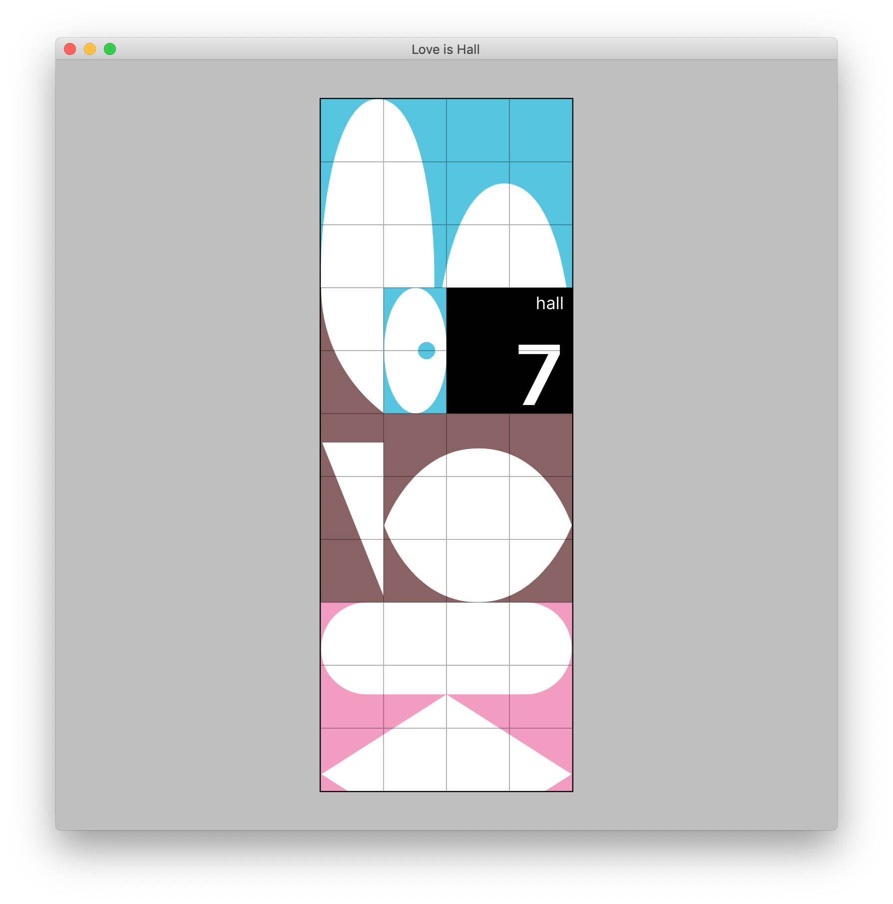

# tooooools-love-is-hall  [](http://chevalvert.fr/)
**Paris Habitat**



<br>

## Installation
```sh
$ git clone https://github.com/chevalvert/tooooools-love-is-hall
$ cd tooooools-love-is-hall
$ npm install
```

## Usage
```sh
$ npm run start
$ npm run test
$ npm run lint
$ npm run build
```

## License
[MIT.](https://tldrlegal.com/license/mit-license)
